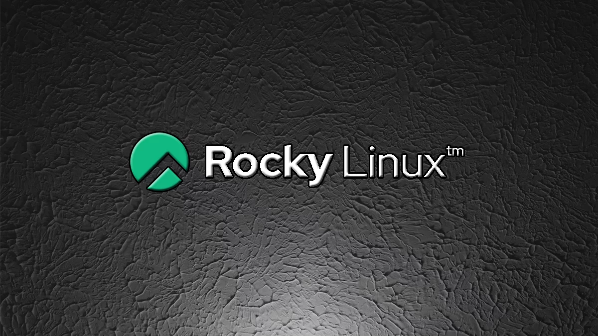

# INTRODUCCIÓN

Rocky Linux es una distribución de Linux, desarrollada por Rocky Enterprise Software. Lanzada para ser compatible y usando el código fuente del sistema operativo Red Hat. El objetivo del proyecto es proporcionar un soporte comunitario, y un sistema operativo de producción a nivel empresa. Está bajo un desarrollo intensivo por parte de la comunidad.

La ultima versión disponible actualmente es Rocky 9.
